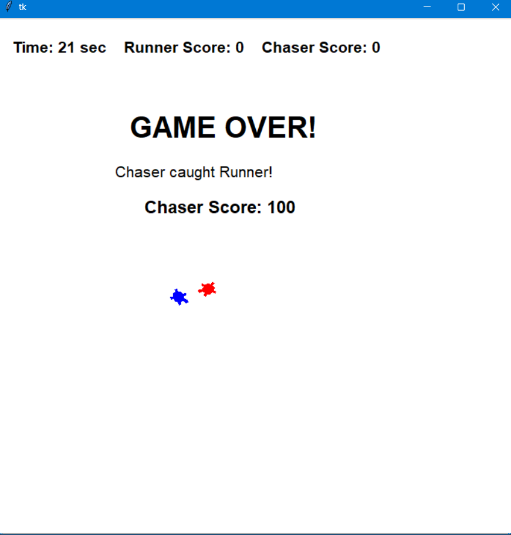

# Turtle Runaway Game 구현 및 수행 결과

## 1\. 프로그램 개요

이 프로그램은 Python의 `turtle`과 `tkinter`를 이용하여 만든 **Runaway Game**이다.

게임에는 두 마리의 Turtle이 존재한다.

* **Runner (파란색 Turtle)**: Chaser에게 잡히지 않고 제한시간 동안 도망간다.
* **Chaser (빨간색 Turtle)**: Runner의 위치를 계산하여 추적한다.

이번 구현에서는 다음 세 가지 기능을 추가하였다.

1. **Timer**: 30초의 제한시간을 설정한다.
2. **Intelligent Turtle**: Chaser가 Runner의 위치를 계산하여 추적하도록 한다.
3. **Scoring System**: Runner가 생존하거나 Chaser가 Runner를 잡았을 때 점수를 부여한다.

\---

## 2\. 사용한 주요 라이브러리

```python
import tkinter as tk
import turtle
import random
import math
```

### tkinter

게임 화면을 생성하기 위해 사용한다.

```python
root = tk.Tk()
canvas = tk.Canvas(root, width=700, height=700)
```

### turtle

Runner와 Chaser를 Turtle 객체로 생성하고 이동시키기 위해 사용한다.

### random

Runner가 매 순간 무작위 행동을 선택하도록 하기 위해 사용한다.

```python
mode = random.randint(0, 2)
```

### math

Intelligent Chaser가 Runner를 향하는 방향을 계산하기 위해 사용한다.

특히 다음 함수를 사용한다.

```python
math.atan2(dy, dx)
```

\---

## 3\. 게임 구성

### 3.1 Runner

Runner는 파란색 Turtle이다.

```python
runner = RandomMover(screen)
```

Runner는 `RandomMover` 클래스를 사용한다.

Runner는 세 가지 행동 중 하나를 무작위로 선택한다.

```python
mode = random.randint(0, 2)
```

* `0`: 앞으로 이동
* `1`: 왼쪽으로 회전
* `2`: 오른쪽으로 회전

따라서 Runner의 이동 방향을 미리 알 수 없으며, Chaser가 Runner를 추적해야 한다.

\---

## 4\. Intelligent Chaser

Chaser는 빨간색 Turtle이며 `IntelligentChaser` 클래스를 사용한다.

```python
chaser = IntelligentChaser(screen)
```

Chaser는 단순히 무작위로 이동하지 않고 Runner의 현재 위치를 이용하여 Runner 방향으로 이동한다.

### 4.1 현재 위치와 Runner 위치

먼저 Chaser와 Runner의 좌표를 가져온다.

```python
my_x, my_y = self.pos()

target_x, target_y = opp_pos
```

그리고 두 Turtle 사이의 x, y 방향 차이를 계산한다.

```python
dx = target_x - my_x
dy = target_y - my_y
```

\---

## 5\. 방향 계산

Chaser가 Runner를 향하기 위해 `atan2()`를 사용한다.

```python
target_angle = math.degrees(
    math.atan2(dy, dx)
)
```

`math.atan2(dy, dx)`는 Runner가 Chaser의 어느 방향에 있는지 계산한다.

`atan2()`의 결과는 라디안이므로 `math.degrees()`를 이용하여 degree로 변환한다.

### 중요

처음 작성한 코드에서는 다음과 같이 작성하였다.

```python
target_angle = turtle.Vec2D(dx, dy)
angle = target_angle.angle()
```

하지만 `Vec2D` 객체에는 `angle()` 메서드가 존재하지 않기 때문에 다음과 같은 오류가 발생하였다.

```text
AttributeError: 'Vec2D' object has no attribute 'angle'
```

이를 해결하기 위해 `math.atan2()`를 사용하도록 수정하였다.

\---

## 6\. Chaser의 회전

Chaser의 현재 방향과 Runner 방향의 차이를 계산한다.

```python
angle_diff = (
    target_angle    - current_heading
    + 180
) % 360 - 180
```

이 계산을 통해 Chaser가 Runner를 향하기 위해 어느 방향으로 회전해야 하는지 결정한다.

```python
if angle_diff > 0:
    self.left(turn_amount)
else:
    self.right(turn_amount)
```

따라서 Chaser는 Runner가 있는 방향으로 회전한 후 앞으로 이동한다.

```python
self.forward(self.step_move)
```

전체적인 동작은 다음과 같다.

> Runner 위치 확인 → 방향 계산 → Chaser 회전 → 앞으로 이동

\---

## 7\. Timer 구현

게임의 제한시간은 30초로 설정하였다.

```python
self.time_left = 30
```

게임이 시작되면 `countdown()` 함수가 1초마다 실행된다.

```python
self.canvas.ontimer(
    self.countdown,
    1000
)
```

`1000`은 1000ms, 즉 1초를 의미한다.

매 1초마다 다음 코드가 실행된다.

```python
self.time_left -= 1
```

따라서 시간은 다음과 같이 감소한다.

```text
30 → 29 → 28 → ... → 2 → 1 → 0
```

\---

## 8\. 게임 종료 조건

게임은 두 가지 경우에 종료된다.

### 8.1 Chaser가 Runner를 잡는 경우

두 Turtle 사이의 거리를 계산하여 일정 거리보다 가까워지면 잡힌 것으로 판단한다.

```python
return dx ** 2 + dy ** 2 < self.catch_radius2
```

잡히면 Chaser에게 100점을 추가한다.

```python
self.chaser_score += 100
```

그리고 게임을 종료한다.

```python
self.game_over = True
```

화면에는 다음과 같은 메시지가 출력된다.

```text
GAME OVER!
Chaser caught Runner!
Chaser Score: 100
```

\---

### 8.2 제한시간이 끝나는 경우

30초가 모두 지나면 Runner가 성공적으로 도망간 것으로 처리한다.

```python
self.runner_score += 100
```

그리고 게임을 종료한다.

화면에는 다음과 같이 표시된다.

```text
TIME UP!
Runner successfully escaped!
Runner Score: 100
```

\---

## 9\. Scoring System

이번 프로그램에서는 다음과 같은 점수 체계를 사용하였다.

|상황|점수|
|-|-:|
|Runner가 30초 동안 잡히지 않음|Runner +100|
|Chaser가 Runner를 잡음|Chaser +100|
|게임 진행 중|점수 변화 없음|

화면 위에는 현재 시간과 두 Turtle의 점수가 표시된다.

```text
Time: 25 sec    Runner Score: 0    Chaser Score: 0
```

\---

## 10\. 수행 결과

프로그램을 실행하면 700 × 700 크기의 게임 화면이 나타난다.

처음에는 다음과 같이 두 Turtle이 배치된다.

* Runner: 화면 왼쪽
* Chaser: 화면 오른쪽

게임이 시작되면 Runner는 무작위 방향으로 움직이고, Chaser는 Runner의 위치를 계산하여 따라간다.

게임 화면 상단에는 다음 정보가 표시된다.

```text
Time: 30 sec    Runner Score: 0    Chaser Score: 0
```

시간이 지나면서 Timer가 감소한다.

예:

```text
Time: 25 sec    Runner Score: 0    Chaser Score: 0
```

Chaser가 Runner를 잡으면 게임이 종료되고 Chaser에게 100점이 부여된다.

```text
GAME OVER!
Chaser caught Runner!
Chaser Score: 100
```

반대로 Runner가 30초 동안 잡히지 않으면 Runner에게 100점이 부여되고 게임이 종료된다.

```text
TIME UP!
Runner successfully escaped!
Runner Score: 100
```

\---

## 11\. 구현 결과 정리

이번 프로그램을 통해 다음 기능을 구현하였다.

### Timer

`ontimer()`를 이용하여 1초마다 시간을 감소시키는 Countdown Timer를 구현하였다.

### Intelligent Turtle

`math.atan2()`를 이용하여 Runner와 Chaser 사이의 방향을 계산하였다.

Chaser는 계산된 방향으로 회전하고 Runner를 추적한다.

### Scoring System

Runner가 제한시간 동안 생존하면 Runner에게 100점을 주고, Chaser가 Runner를 잡으면 Chaser에게 100점을 주도록 구현하였다.

### Game Over

Runner가 잡히거나 제한시간이 종료되면 게임을 종료하도록 구현하였다.

\---

## 12\. 결론

기존의 Runaway Game에 **Timer, Intelligent Turtle, Scoring System**을 추가하여 게임의 목표와 종료 조건을 명확하게 만들었다.

특히 Chaser는 Runner의 현재 좌표를 이용하여 이동 방향을 계산하기 때문에 단순한 Random Movement가 아니라 **상대방의 위치를 고려하는 추적 AI**로 동작한다.

또한 `turtle.Vec2D.angle()`을 사용하면서 발생했던 오류를 `math.atan2()` 기반의 방향 계산으로 수정하여 정상적으로 Chaser가 Runner를 추적하도록 구현하였다.


\---

## 13\. 수행 결과 이미지

실제 프로그램을 실행한 결과는 다음과 같다.



위 실행 결과에서는 다음과 같은 상황을 확인할 수 있다.

* 제한시간이 **21초** 남아 있는 상태에서 게임이 종료되었다.
* **Runner Score는 0점**이다.
* **Chaser Score는 100점**이다.
* 화면 중앙에 `GAME OVER!`가 표시되었다.
* `Chaser caught Runner!` 메시지를 통해 Chaser가 Runner를 잡아서 게임이 종료되었음을 확인할 수 있다.
* 파란색 Turtle은 **Runner**, 빨간색 Turtle은 **Chaser**를 나타낸다.
* Chaser가 Runner를 잡았기 때문에 Chaser에게 **100점**이 부여되었다.

따라서 해당 실행 결과를 통해 **Intelligent Chaser의 추적 기능, Timer, Scoring System 및 게임 종료 조건이 정상적으로 동작한 것을 확인할 수 있다.**

